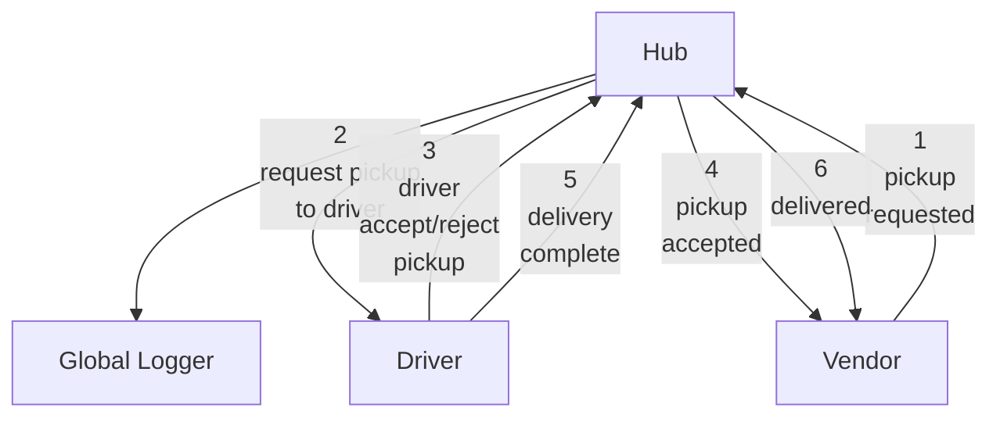

List of events:

            "request-pickup": Sent from Vendor to Hub
            "request-pickup-to-driver": Sent from Hub to Driver
            "driver-accept-pickup": Sent from Driver to Hub
            "driver-reject-pickup": Return to Item to Queue
            "pickup-accepted": Sent from Hub to Drivers and Client to notify them (out for "delivery")

            "delivery-complete": From Driver to Hub
            "delivered": Sent from Hub to Vendor to notify

Flow chart of events. Each pickup request startes a 6 step process.

The messages passed at each step are as follows:

    1 pickup requested
        Item (includes Vendor)
    2 request pickup to driver
        Item
        Driver
    3 driver accept pickup
        Item
        Driver
    3.5 driver reject pickup
        Item
        Driver
    4 pickup accepted
        Item
        Driver
    5 delivery complete
        Item
        Driver
    6 delivered
        Item

Summary of objects:

Here are JSON objects that get passed by the messaging system. In (parenthesis) are helper function attached to the object when on the client.

Vendor:

    Vendor:
        id: String
        name: String
        (relay:)

Driver:

    Driver:
        id: String
        name: String
        (relay:)

Item:

    Item:
        id: String
        contents: String (description)
        vendor: Object (Vendor Object)

    
